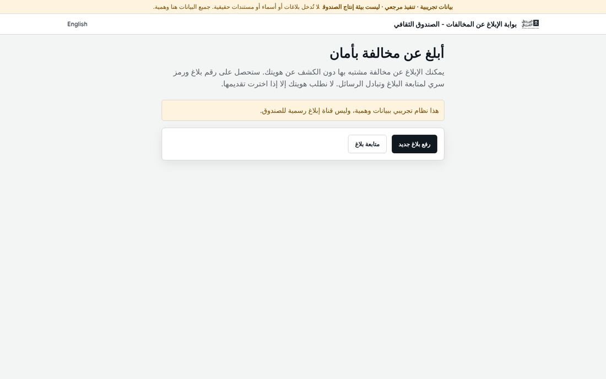
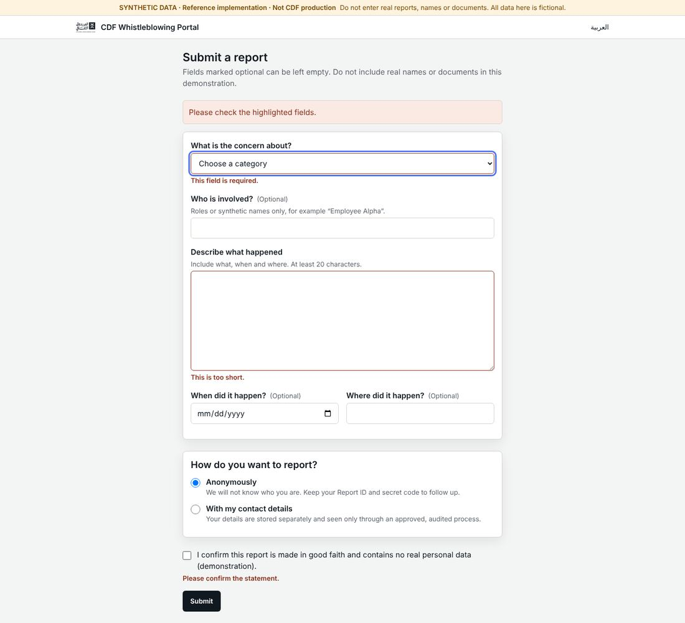
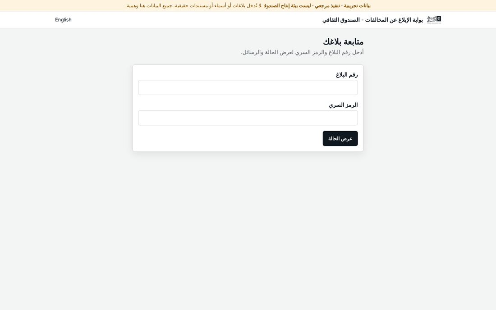
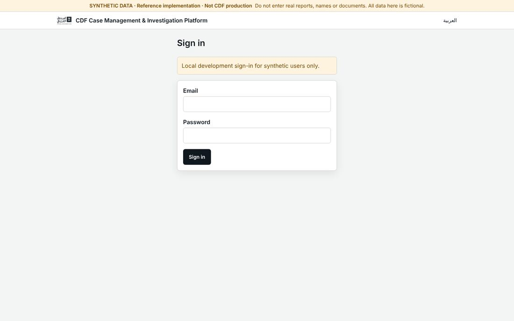
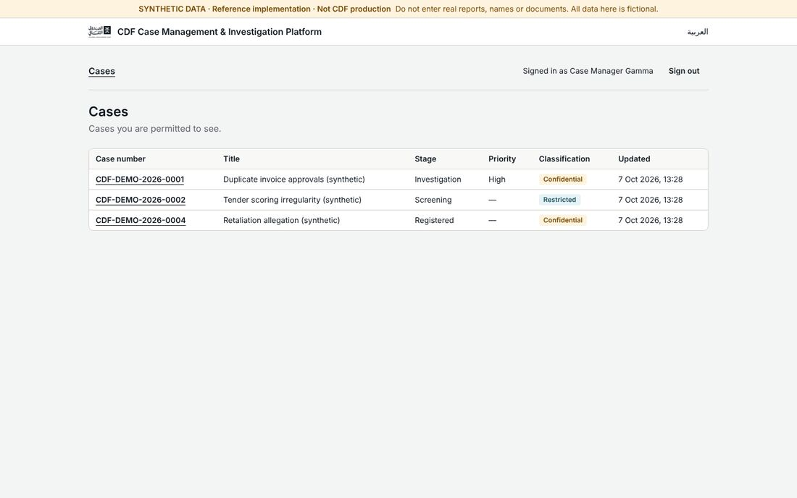
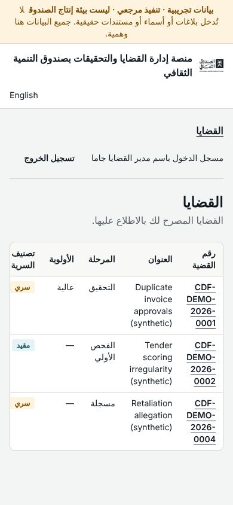
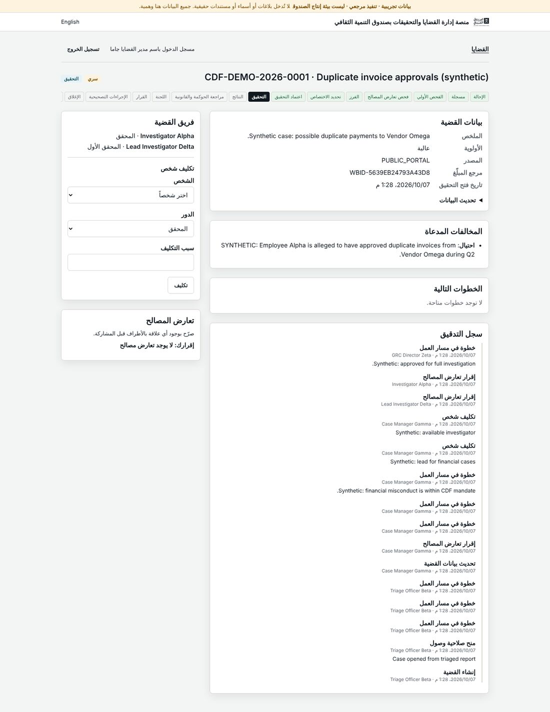
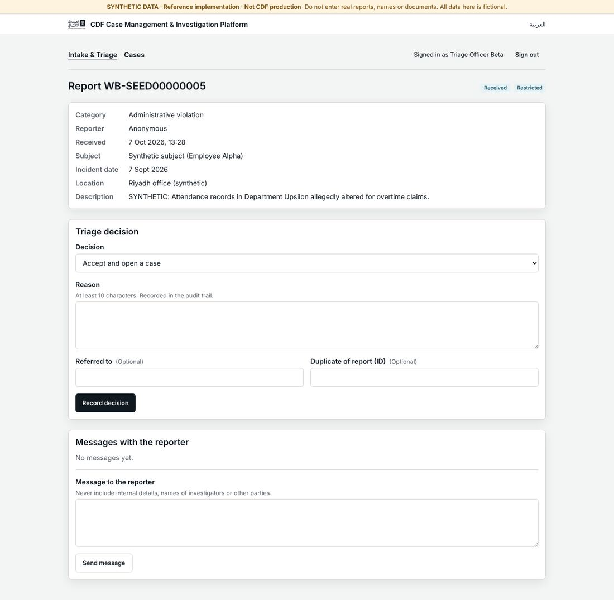

# Design review: CDF platform against the CDF design system (with Google Stitch)

Date: 2026-10-07 · Scope: PR #3 head (`phase-2-6/first-vertical-slice`), both apps, Arabic (RTL) and English (LTR), desktop 1440 px and mobile 390 px · Data: synthetic seed only.

Reference sources: `CDF_Design_Tokens.json` v1.1 (mirrored in `packages/ui/tokens/` and `packages/ui/src/tokens.css`), the CDF Figma design-system spec, the CDF brand compliance matrix (Design Guide page refs), the UI/UX re-architecture report.

## How this review was made

1. Both apps were built and run locally against PostgreSQL 16 with the synthetic seed (`pnpm db:reset`, `pnpm build`, `next start`), signed in as the synthetic Case Manager and Triage Officer, and screenshotted with Playwright in both languages. The screenshots are in [`screens/`](screens/).
2. The CDF tokens were turned into a Stitch design system ([`stitch/DESIGN.md`](stitch/DESIGN.md)): Cinder Black primary, warm-gray neutral, Powder Blue and Chardonnay accents, 4 px roundness, IBM Plex Sans (Stitch has no Segoe UI and the Arabic brand font is still `BRAND_SOURCE_REQUIRED`).
3. Stitch generated four comparison screens from that design system, with the same content as ours: portal home (AR), report form (AR), case list (EN), case detail (AR). They are in the Stitch project "CDF Case Platform design review (synthetic data)"; IDs are in [`stitch/metadata.json`](stitch/metadata.json). This environment's network policy blocks Stitch's image and HTML download hosts (`lh3.googleusercontent.com`, `contribution.usercontent.google.com`), so the Stitch renders are viewable in Stitch itself and summarised here, not embedded.
4. Contrast ratios below are computed with the WCAG 2.x relative-luminance formula from the token hex values.

## Summary

The token layer is faithful: every primitive and semantic hex in `tokens.css` matches the JSON, status pairs all clear 6:1, the focus ring is visible, logical properties are used throughout and RTL mirroring is correct at the layout level. What lets the screens down is a short list of component-level gaps, most of which are one-file fixes in `packages/ui`:

| #   | Finding                                                                      | Where                                   | Severity | Brand / WCAG ref                         |
| --- | ---------------------------------------------------------------------------- | --------------------------------------- | -------- | ---------------------------------------- |
| 1   | Logo renders at 40 × 21 px, unreadable                                       | both headers                            | High     | Design Guide p.10 (horizontal ~152 × 26) |
| 2   | Form-control borders are 1.50:1 against white                                | every input, select, textarea, checkbox | High     | WCAG 1.4.11 (3:1)                        |
| 3   | Mixed Arabic/English text renders with punctuation on the wrong side         | case detail, audit trail, allegations   | High     | RTL rule (matrix "RTL_STATUS")           |
| 4   | Untranslated values in the Arabic UI (`PUBLIC_PORTAL`, English person names) | case detail, team, audit                | Medium   | i18n catalogue                           |
| 5   | Table header is light gray, not Cinder                                       | all tables                              | Medium   | Design Guide pp.41–44                    |
| 6   | Workflow tracker shows 15 chips in one row and clips at the screen edge      | case detail                             | Medium   | pp.69–80 drill-down structure            |
| 7   | Mobile tables: case numbers break into four lines, last column hidden        | case list, intake (390 px)              | Medium   | pp.69–80 responsive                      |
| 8   | Native radio/checkbox use the browser's blue, not the brand                  | report form, case forms                 | Low      | pp.12–15 palette                         |
| 9   | Navigation sits in a second bar inside the page, not in the header           | investigation app                       | Medium   | pp.29–39 header                          |
| 10  | No dark mode at runtime although dark tokens exist                           | both apps                               | Medium   | spec "Light, Dark, System"               |
| 11  | Font depends on the viewer's OS; no Arabic brand face loaded                 | both apps                               | Medium   | pp.21–27; matrix BRAND_SOURCE_REQUIRED   |
| 12  | Status and classification badges look identical                              | intake detail, case header              | Low      | pp.29–39 chips                           |
| 13  | Audit trail dominates the case page and every entry reads "workflow step"    | case detail                             | Low      | p.85 clear messaging                     |
| 14  | Portal home is a bare title and two buttons; no "how it works" or footer     | portal                                  | Low      | pp.4–7 clarity                           |

## Screen by screen

### Public portal: home (`/`)

- **Logo (finding 1).** `layout.tsx` renders ``; with Tailwind's `height:auto` the 800 × 420 artwork lands at 40 × 21 px, so the wordmark is unreadable in both languages. The brand guide's horizontal reference is about 152 × 26. Use a horizontal lockup at 28–32 px height (the supplied PNG is a stacked lockup with padding; ask CDF brand for the official horizontal SVG) and drop the fixed width.
- **Content (finding 14).** One heading, one paragraph, one alert, two buttons in a card. Stitch's version keeps the same headline and two CTAs but adds three trust cards (identity protected, follow up with ID + secret, reviewed by a dedicated team), a numbered three-step "how it works" and a footer with privacy and FAQ links. Adopting the structure is worthwhile; the copy must stay truthful (see "What not to take from Stitch").
- The CTA card's shadow on a page that is otherwise flat reads as a stray elevation; the spec reserves elevation for raised surfaces. A plain button row without the card would match "reduced radii/shadows".
- English and mobile: layout mirrors correctly; on 390 px the classification strip takes three lines, and in the investigation app the long product name pushes the language link onto its own line (the header has no small-screen arrangement).

### Public portal: report form (`/report`)

- **Control borders (finding 2).** Inputs use `border-cdf-border` = warm gray `#D7D2CB` on white: **1.50:1**. WCAG 1.4.11 needs 3:1 for the boundary of a form control. On the gray page background it is 1.36:1. Add a control-border token: `#8B9095` (neutral 50) gives 3.22:1 on white and 5.04:1 on the dark surface `#19212B`. Keep warm gray for card and table dividers, where it is decorative.
- **Radio and checkbox colour (finding 8).** They render in Chromium's default blue. One line in `tokens.css`, `accent-color: var(--cdf-primary)`, brings them to Cinder in light and white in dark.
- Validation is good: summary alert at the top, inline messages tied with `aria-describedby`, focus moved to the first invalid field. The select's red invalid border is hidden by the focus ring when it is focused, which is acceptable.
- The Arabic date input shows `mm/dd/yyyy` (browser-locale native picker). Low priority; an Arabic hint under the field ("يوم/شهر/سنة") is the cheap fix.
- Stitch's version splits the form into three steps (details, attachments, review) with a privacy side panel ("don't put your name in the description if you want to stay anonymous"). The side-panel guidance is worth taking now; the multi-step split only makes sense once attachments exist.

### Public portal: follow-up (`/follow-up`)

- Clean and correct; Report ID and secret fields are `dir="ltr"`. Same control-border issue as above.

### Investigation workspace: sign-in (`/login`)

- Fine. The development-login notice is the right tone. Same control-border issue.

### Investigation workspace: case list (`/cases`)

- **Table header (finding 5).** `CDFTable` uses `bg-cdf-surface-subtle` (`#F8F8F7`) for `thead`. The design guide (pp.41–44) and the compliance matrix specify a Cinder header with neutral rows. Swap to `bg-cdf-primary text-cdf-primary-text`; in dark mode the semantic tokens invert it automatically.
- **Navigation (finding 9).** The header carries only logo, product name and language link; the app nav, user name and sign-out sit in a second bar inside `<main>`. Two stacked bars with different alignment make the page look unfinished. Move `AppNav` into `CDFShell`'s existing `nav` and `utilities` slots. Stitch put product nav in the top bar (and a sidebar for the full module list), which is where the spec's "Header" component puts it.
- Stitch's list adds filter chips, pagination and an assigned-investigator column. Filters and pagination will be needed once there are more than a handful of cases; not urgent for three seed rows.

- **Mobile (finding 7).** At 390 px the case number `CDF-DEMO-2026-0001` breaks at every hyphen into four lines and the "Updated" column is pushed off-screen. The region is keyboard-scrollable (good) but nothing tells the user it scrolls. Add `whitespace-nowrap` to identifiers, and below `sm` render each row as a stacked card (number + badges on one line, title, state and date beneath).

### Investigation workspace: case detail (`/cases/[id]`)

- **Bidirectional text (finding 3).** Free-text values are English inside RTL containers without `dir="auto"`, so sentence punctuation jumps to the wrong end: ".Synthetic case: possible duplicate payments to Vendor Omega", ".Vendor Omega during Q2", ".Synthetic: approved for full investigation". Real Arabic-language cases will contain Latin names, amounts and reference numbers, so this is not only a synthetic-data artefact. Put `dir="auto"` on user-supplied text in `CDFDescriptionList` values, `CDFTimeline` bodies, allegation items and table title cells.
- **Untranslated values (finding 4).** "المصدر: PUBLIC_PORTAL" is a raw enum; team members and audit actors show English display names ("Investigator Alpha · المحقق") although actors carry `displayNameAr`. Add `source.*` message keys and use the Arabic name when the locale is `ar`.
- **Workflow tracker (finding 6).** Fifteen step chips sit in one horizontal row and are clipped at the inline-end edge on a 1440 px screen in Arabic (and English); the clipped chip gives no hint that the row scrolls. Options, cheapest first: let the list wrap; or group the 15 states into the 6–8 phases the business talks about (Stitch's version shows 8 phases with check icons for completed, a filled marker for current, outline for future) with the detailed state as a caption. Completed steps use the success-green fill, which reads as "passed a check"; a neutral filled style with a check icon is closer to the guide's restrained palette.
- **Badges (finding 12).** In the header, classification "سري" (warning tone) and state "التحقيق" (info tone) are both small tinted rectangles; on the intake page "Received" and "Restricted" are both info-blue and indistinguishable. Give classification its own treatment (outlined chip with a lock glyph, colour by level) and keep state as the filled chip.
- **Audit trail (finding 13).** Fifteen entries, seven of them titled "خطوة في مسار العمل", fill most of the page. Title workflow entries with the transition name ("اعتماد التحقيق", "تأكيد الاختصاص"), show the latest five and a "show all" link. Stitch moved history to its own tab ("السجل"), which keeps the overview short.
- What works: two-column layout, the "next steps" card with blocked actions explained, the conflict-of-interest card, `details/summary` for the edit form.

### Investigation workspace: intake (`/intake`, `/intake/[id]`)

- Good structure: facts, decision form, reporter messages. The reporter-message hint ("never include internal details…") is exactly right.
- Badge collision as above (status and classification both info-blue).
- The decision `select` defaults to "Accept and open a case". A deliberate empty "Choose a decision" first option avoids accidental acceptance.

## Cross-cutting

- **Dark mode (finding 10).** `tokens.css` defines a full dark theme, the spec calls for Light/Dark/System, and the baseline app had all three; both layouts hard-code `data-theme="light"` and there is no switch. A cookie-backed theme switch next to the language switch, defaulting to System via `prefers-color-scheme`, completes what the tokens already support.
- **Typography (finding 11).** The stack is `"Segoe UI", Tahoma, "Noto Sans Arabic", "Geeza Pro", Arial`. Windows users get Segoe UI, Mac users Geeza Pro for Arabic, others whatever Noto or fallback is installed, so Arabic shapes and weights vary by machine. Until CDF supplies the brand Arabic face, self-host one open Arabic-Latin family through `next/font` (IBM Plex Sans Arabic is what the Stitch comparison used; Noto Sans Arabic is the other safe choice) so every viewer sees the same thing. Body copy runs at 16 px while the token body1 is 14 px; keep 16 px for Arabic legibility and record the deviation in the token notes.
- **Footer.** Neither app has a footer; the guide's GUI component list includes one. Privacy notice, contact and version belong there.
- **Contrast check of the tokens in use.** Secondary text on page 5.43:1, success 6.33, warning 6.79, info 7.06, danger 7.14, focus ring on white 4.19 (≥ 3 required). `textMuted #8B9095` is correctly not used for text (3.22:1). The only failing pair in use is the control border (finding 2).

## What not to take from Stitch

Stitch's output was useful for layout and hierarchy, but its generated copy is not safe to copy into a whistleblowing product:

- It invented security claims the platform does not make: "end-to-end encryption (E2EE)", "256-bit SSL", "IP address and digital fingerprint are not stored". The portal does hash a client key for rate limiting; promises to reporters must come from the security design, not a generator.
- It added "local autosave of the report draft". Persisting a whistleblowing draft on the device is a risk on shared or monitored computers and should stay out unless deliberately designed.
- It used realistic Arabic personal names (for example a supervisor's full name) where this project requires obviously synthetic names.
- It added a hotline and support channel that do not exist.

## Proposed order of work

1. Header: horizontal logo at readable size, move app navigation and user menu into the header (findings 1, 9).
2. Forms: control-border token at 3:1 and `accent-color` (findings 2, 8).
3. Bidi and i18n: `dir="auto"` on user text, translate `source`, Arabic display names (findings 3, 4).
4. Tables and tracker: Cinder header, nowrap identifiers and stacked mobile rows, grouped workflow phases (findings 5, 6, 7).

Then dark-mode switch, self-hosted Arabic font, badge differentiation, audit-trail condensing and the portal home content.

## Stitch artefacts

- Project: `projects/14126298224946012670` ("CDF Case Platform design review (synthetic data)").
- Design system: `assets/4058424316666483264` ("CDF Enterprise Design System"), built from [`stitch/DESIGN.md`](stitch/DESIGN.md).
- Screens: see [`stitch/metadata.json`](stitch/metadata.json).
